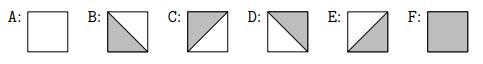

# cities
On a rectangular map divided into an n × m checkerboard, cities have been painted. As a result, each square on the checkerboard is either empty (no city) or partially filled, indicating a city or a part of it. If two non-empty squares on the checkerboard share a painted edge, they belong to the same city. The program will count the number of cities on the map.

`input specification`  
The first line of the input contains two natural numbers n and m, separated by a single space, representing the dimensions of the checkerboard and satisfying 1 <= n, m <= 2000. The next n lines contain a description of each row of the checkerboard. Each row consists of m characters from the set {A, B, C, D, E, F}, encoding the elements of the checkerboard in the following way:  

`output specification`  
In the first and only line of the output, the program will print a single natural number which is the number of cities on the map.  

To compile: `g++ -std=gnu++17 -static -DSPRAWDZACZKA main.cpp`  
To run: `./a.out`  
